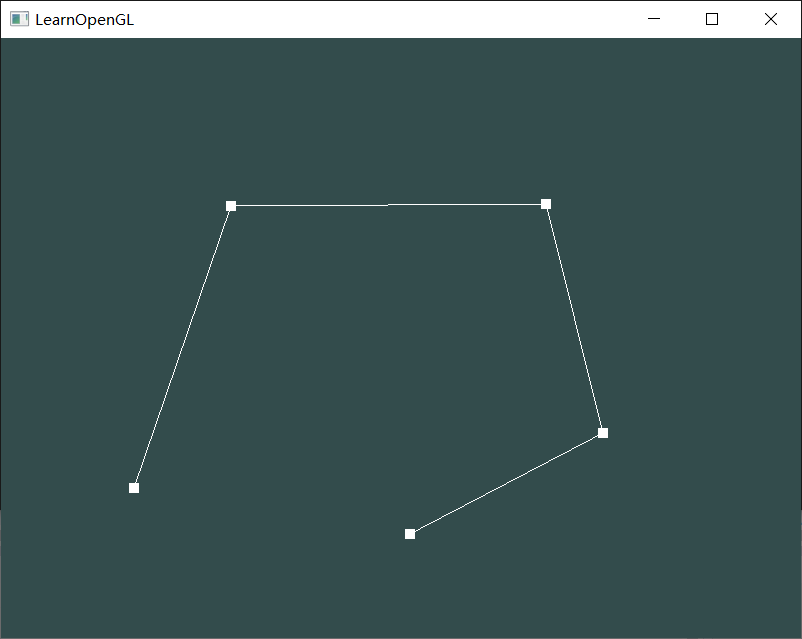
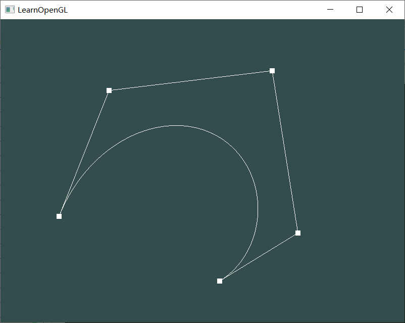
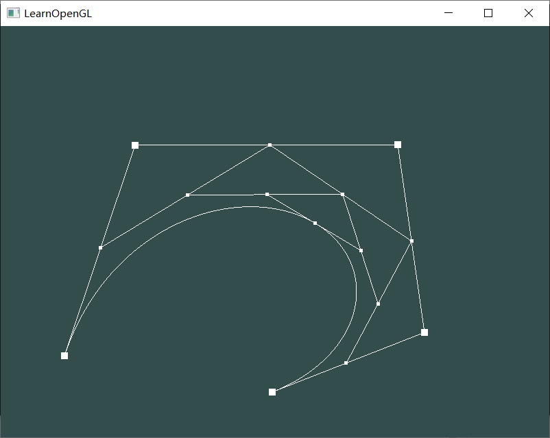

# Homework 8 - Bezier Curve

1. 监听鼠标移动事件，获取鼠标的当前位置，并将位置坐标转化至[-1, 1]

   ```cpp
   glfwSetCursorPosCallback(window, mouse_callback);
   void mouse_callback(GLFWwindow* window, double xpos, double ypos)
   {
   	mousex = (xpos - SCR_WIDTH / 2) / SCR_WIDTH * 2;
   	mousey = (SCR_HEIGHT / 2 - ypos) / SCR_HEIGHT * 2;
   }
   ```

2. 监听鼠标点击事件，点击鼠标左键，则将鼠标当前位置（x，y）加入points数组中；点击鼠标右键，则删除最后一个添加的点（只需将n减一）。（n为点的最后下标，总共有n+1个点，n初始值为-1）

   ```cpp
   glfwSetMouseButtonCallback(window, mouse_button_callback);
   void mouse_button_callback(GLFWwindow* window, int button, int action, int mods) {
   	if (action == GLFW_PRESS) {
   		if (button == GLFW_MOUSE_BUTTON_LEFT) {
   			n++;
   			points[2 * n] = mousex;
   			points[2 * n + 1] = mousey;
   		}
   		else if (button == GLFW_MOUSE_BUTTON_RIGHT && n >= 0) {
   			n--;
   		}
   	}
   }
   ```

3. 定义 Bernstein 基函数：$$ B_{i,n}(t) = \frac{n!}{i!(n-i)!}t^i(1-t)^{n-i}, i=0,1...n $$

   ```cpp
   float bernstein(int i, int n, float t) {
   	int coef = 1;
   	for (int k = 2; k <= n; k++) {
   		coef *= k;
   	}
   	for (int k = 2; k <= i; k++) {
   		coef /= k;
   	}
   	for (int k = 2; k <= n - i; k++) {
   		coef /= k;
   	}
   	return coef * pow(t, i) * pow(1 - t, n - i);
   }
   
   ```

4. 绘制控制点及控制点的连线

   ```cpp
   glPointSize(10);
   glBindVertexArray(VAO);
   glBindBuffer(GL_ARRAY_BUFFER, VBO);
   glBufferData(GL_ARRAY_BUFFER, 2 * (n + 1) * sizeof(float), points, GL_DYNAMIC_DRAW);
   glVertexAttribPointer(0, 2, GL_FLOAT, GL_FALSE, 2 * sizeof(float), (void*)0);
   glEnableVertexAttribArray(0);
   glUseProgram(shaderProgram);
   glDrawArrays(GL_POINTS, 0, n + 1);
   glDrawArrays(GL_LINE_STRIP, 0, n + 1);
   ```

   效果如下：

5. 绘制Bezier曲线：计算100个Bezier曲线上的点的坐标，绘制这100个点的连线，用来逼近Bezier曲线。Bezier曲线上的点的坐标计算公式为：$$ Q(t) = \sum _{i=0}^nP_iB_{i,n}(t) $$

   ```cpp
   //给曲线顶点数据赋值
   for (float t = 0; t <= 100; t += 1.0f) {
       tempx = tempy = 0;
       for (int i = 0; i <= n; i++) {
           float b = bernstein(i, n, t / 100);
           tempx += points[2 * i] * b;
           tempy += points[2 * i + 1] * b;
       }
       vertices[int(2 * t)] = tempx;
       vertices[int(2 * t + 1)] = tempy;
   }
   
   //绘制曲线
   if (n >= 1) {
       glBindVertexArray(VAO);
       glBindBuffer(GL_ARRAY_BUFFER, VBO);
       glBufferData(GL_ARRAY_BUFFER, sizeof(vertices), vertices, GL_DYNAMIC_DRAW);
       glVertexAttribPointer(0, 2, GL_FLOAT, GL_FALSE, 2 * sizeof(float), (void*)0);
       glEnableVertexAttribArray(0);
       glUseProgram(shaderProgram);
       glDrawArrays(GL_LINE_STRIP, 0, 101);
   }
   ```

   效果如下：

   

6. 动态地呈现Bezier曲线的生成过程：

   - 设置一个t在0到1直接变化，可以令t在每一次循环渲染中加0.0001；
   - 循环获得各轮中间点：使用上一轮相邻的两个点用t进行差值，获得下一轮的点。每一轮获取的点数比上一轮少一，直到最后只有一个点，那个点就是Bezier曲线在t处的位置；
   - 绘制各轮中间点及它们的连线。

   ```cpp
   t += 0.0001;
   if (t > 1) t = 0.0;
   
   for (int i = 0; i <= 2 * n + 1; i++) {
       processp[i] = points[i];
   }
   for (int k = n; k > 0; k--) {
       for (int i = 0; i < k; i++) {
           processp[2 * i] = (1 - t) * processp[2 * i] + t * processp[2 * (i + 1)];
           processp[2 * i + 1] = (1 - t) * processp[2 * i + 1] + t * processp[2 * (i + 1) + 1];
       }
       glPointSize(5);
       glBufferData(GL_ARRAY_BUFFER, 2 * k * sizeof(float), processp, GL_DYNAMIC_DRAW);
       glVertexAttribPointer(0, 2, GL_FLOAT, GL_FALSE, 2 * sizeof(float), (void*)0);
       glEnableVertexAttribArray(0);
       glUseProgram(shaderProgram);
       glDrawArrays(GL_POINTS, 0, k);
       glDrawArrays(GL_LINE_STRIP, 0, k);
   }
   ```

   效果如下（动态效果见hw8.mp4)：

   

   